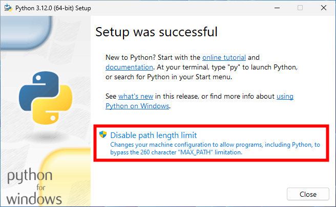
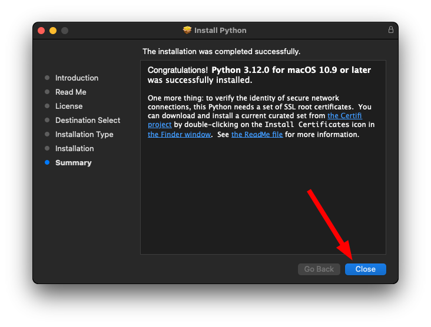
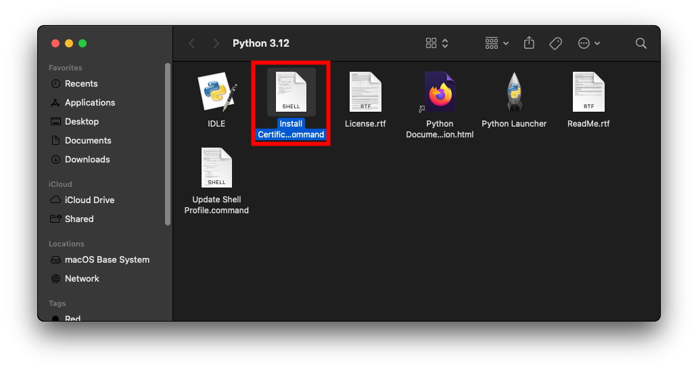
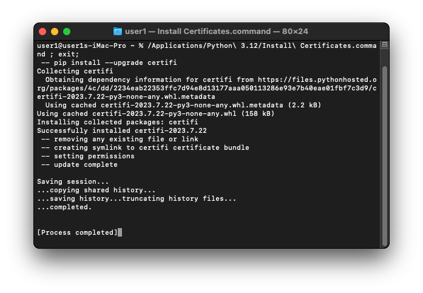
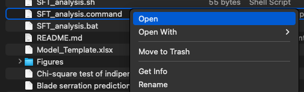

# Sharp Force Trauma (SFT) models

This document is a guide to use the the machine algorithms to predict serration and blade bevel using the following traits:
- **General morhology of the kerf shape:** Ellipse, D shape or Indeterminate
- **Shape of the cross-profile (entrance and exit):** V shape or Y shape
- **Location of the rising profile (entrance and exit):** single, bilateral or absent
- **Presence or absence of feathering:** present or absent
- **Presence or absence of shards:** present or absent
- **Location (entrance, center and exit):** single, bilateral or absent
- **General morphology of the mounding:** marked, not marked or absent


## Supported versions:

- Python 3 
- JupyterLab (Jupyter Notebook not tested)

## Before starting please download the .zip file at https://github.com/sciadi98/dissertation-steiger-2022/archive/refs/heads/main.zip and unzip it


## Windows 10/11
### Installation
Download Python at https://www.python.org/downloads/ 

*Install Python*
1. Run the installer


3. Click "Install Now"


4. Disable "Path length limit" > close



*Open app*
1. Go in the unzipped dissertation-steiger-2022-main directory
2. Double click on "SFT_analysis.bat" file
3. Follow the instructions on the terminal

*Prepare the data*

1. Use the template provided in the main directory
2. The template can be fill with the following variables: E, D or I (shape);  V or I/ (profile shape); single, bilateral or absent (rising); present or absent (shards); present or absent (feathering); single, bilateral or absent (mounding location); marked, not marked or absent (mounding general morphology)

> [!WARNING]  
> It is imperative to put the file excel in the main directory "Dissertation_steiger_2022" otherwise the won't be loaded correctly.


## MacOS
Download Python at https://www.python.org/downloads/
 
*Install Python* 
1. After accepting user agreement > Install > close



2. Double click on install.certificates.cmd 



3. execute > close the terminal 



*Open app*
1. Go in the unzipped dissertation-steiger-2022-main directory
2. right click "SFT_analysis.command" file > open > open




*Prepare the dataset*

1. Use the template provided in the main directory
2. The template can be fill with the following variables: E, D or I (shape);  V or I/ (profile shape); single, bilateral or absent (rising); present or absent (shards); present or absent (feathering); single, bilateral or absent (mounding location); marked, not marked or absent (mounding general morphology)

> [!WARNING]  
> It is imperative to put the file excel in the main directory "Dissertation_steiger_2022" otherwise the won't be loaded correctly.
## Linux


#### Ubuntu or Debian derivatives

```
$ sudo apt install python3
````
#### openSUSE
Python is already pre-installed on openSUSE, if not execute:
```
$ sudo zypper install python3
```
#### Fedora or RedHat derivatives
Python is already pre-installed on Fedora, if not execute :
```
$ sudo dnf install python3
```
#### Arch derivatives
```
$ sudo pacman -S python3
```

*Open app* 
1. Open a terminal > execute "SFT_analysis"

*Prepare the dataset*

1. Use the template provided in the main directory
2. The template can be fill with the following variables: E, D or I (shape);  V or I/ (profile shape); single, bilateral or absent (rising); present or absent (shards); present or absent (feathering); single, bilateral or absent (mounding location); marked, not marked or absent (mounding general morphology)

> [!WARNING]  
> It is imperative to put the file excel in the main directory "Dissertation_steiger_2022" otherwise the won't be loaded correctly.

## Citation 
These models are based on a pubblication. If you use it successfully for your research please be so kind to cite our work:
## Contributing

